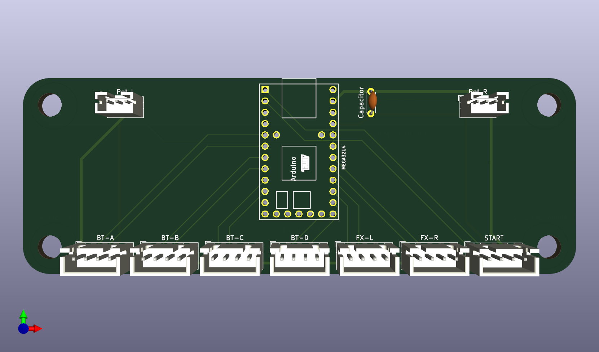
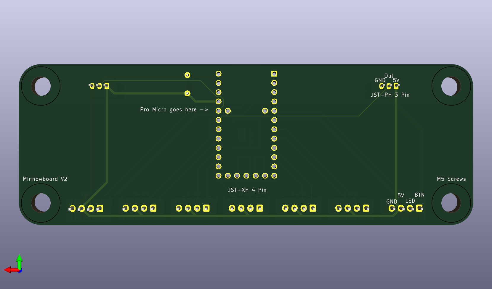

# DJDao Arduino Drop-in Replacement

This project aims to be a drop-in replacement for DJDao SVSE5 and SVRE9 PCBs. Currently only supports potentiometers and DJDao-style wiring.

LEDs are wired to 5V and a GPIO pin on the Pro Micro. Writing LOW will turn ON the LED, and writing HIGH will turn it OFF. If your LEDs don't turn on, try flipping them around.

# Pin assignments

| Button | Data | LED |
| ------ | ---- | --- |
| BT-A   | 2    | 3   |
| BT-B   | 4    | 5   |
| BT-C   | 6    | 7   |
| BT-D   | 10   | 16  |
| FX-L   | 14   | 15  |
| FX-R   | A0   | A1  |
| Start  | 1    | 0   |
| VOL-L  | A2   | N/A |
| VOL-R  | A3   | N/A |

# Code

Use a modifed version of [KnucklesLee&#39;s code](https://github.com/knuckleslee/RhythmCodes/).

# Known Issues

V1: Pots are jittery, affected by the LEDs, and each other(?)
V1: Button pins have swapped GND and 5V

V2: Pots are a bit jittery when using a 0.1μF capacitor. Possibly fixed with higher value cap?
V2: Pro Micro footprint is actually a Teensy 2.0 footprint. This is only a cosmetic difference.

# ToDO

- Add pins for a reset button
- Replace Teensy footprint with Pro Micro footprint
- Add quadrature encoder support
- Add firmware code
